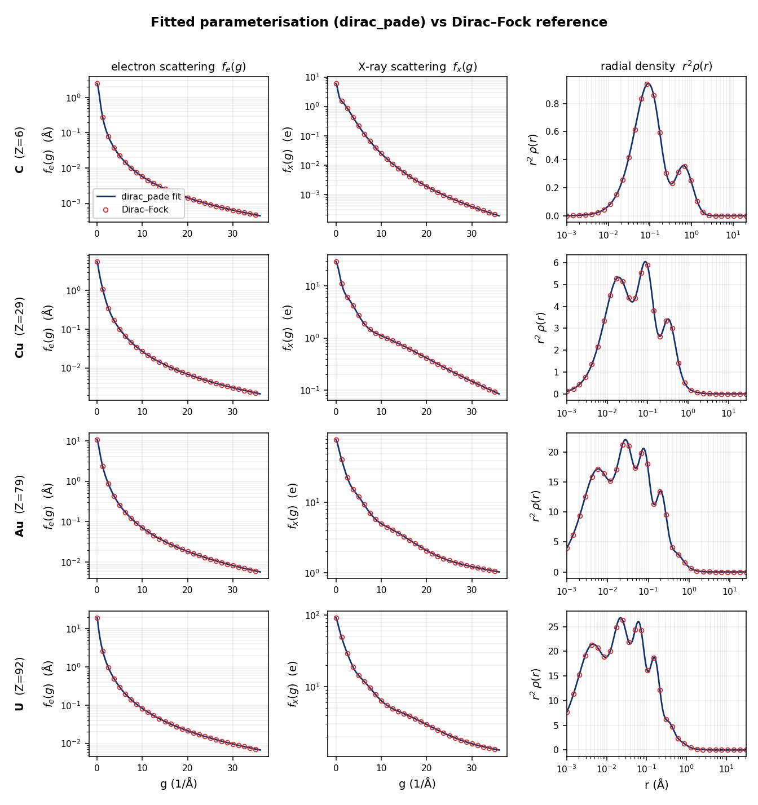
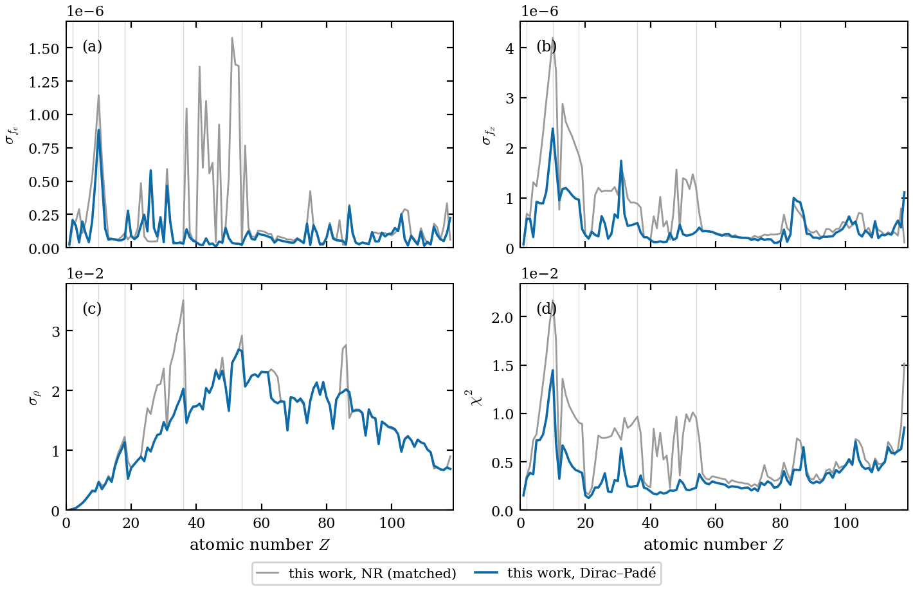

# adaptive_dirac_pade_scattering_factor_2026

<!-- readme-archetype: library -->

## Project information

Developed by Ivan Lobato / [NeuralSoftX](https://neuralsoftx.com/).
Contact: `ivan.lobato@neuralsoftx.com`.
Licence: `Apache-2.0`.
Canonical repository: [NeuralSoftX/adaptive_dirac_pade_scattering_factor_2026](https://github.com/NeuralSoftX/adaptive_dirac_pade_scattering_factor_2026).

## Overview

Updated relativistic reference densities and an **element-adaptive
parameterisation** of electron and X-ray scattering factors, electron densities,
and electrostatic potentials for the neutral atoms `Z = 1`–`118`. Hydrogen uses
the exact point-Coulomb Dirac 1s density; `Z = 2`–`118` use all-electron
Dirac–Fock densities computed with `atomx`.

[](LICENSE)


[](https://arxiv.org/abs/2608.14934v1)

> I. Lobato, Z. Zhang, S. Van Aert and A. I. Kirkland, manuscript submitted to
> *Acta Crystallographica Section A* (2026).

### Publication status

This repository accompanies the manuscript submitted to *Acta Crystallographica
Section A* on 14 August 2026 (IUCr reference `TW5019`). The public preprint is
[arXiv:2608.14934v1](https://arxiv.org/abs/2608.14934v1), submitted on 14 August
2026. Journal acceptance is not established.

<p align="center">
  
</p>

<p align="center"><em>The closed-form Dirac–Padé parameterisation (<code>adaptive_dirac_pade</code>,
blue curve) over the Dirac–Fock reference (red open circles), for carbon, copper,
gold and uranium:
electron scattering <code>f_e(g)</code>, X-ray scattering <code>f_x(g)</code>,
and the radial density <code>r²ρ(r)</code> — one coefficient set per element
reproduces all three.</em></p>

### What's new

- **Relativistic reference for all 118 atoms** — the exact point-Coulomb Dirac
  1s density for hydrogen and finite-Fermi-nucleus Dirac–Fock densities computed
  with `atomx` for `Z = 2`–`118`. Perturbative Breit and leading QED corrections
  accompany the multi-electron atomic-energy calculations but do not alter the
  deposited orbitals.
- **Element-adaptive basis** — the number of terms `n_t(Z)` grows with shell
  complexity (2 for H up to 15 for the actinides), instead of one fixed size for
  every atom.
- **Simultaneous real- and reciprocal-space fit** — `f_e(g)`, `f_x(g)` and the
  density `ρ(r)` are fitted together out to `36 Å⁻¹`, so the density shell
  structure is reproduced, not just its Fourier transform.
- **Exact constraints** — charge neutrality (`f_x(0) = Z`), the Ibers `⟨r²⟩`
  relation, and `⟨r⁴⟩` are enforced analytically.
- **Charge-carrying Dirac–Padé term** — a Padé-type
  polynomial-times-exponential shape channel, motivated by the hydrogenic
  Dirac 1s density, keeps every derived quantity in closed form without
  assigning the fitted term to a physical shell.
- **Single precision (float32)** — delivered in the working precision of GPU
  multislice codes.
- **Complete-domain physicality certificate** — every released coefficient set
  gives positive summed scattering factors, density and potential over its full
  physical domain; the independently reproducible certificate is deposited with
  the coefficients.

### Accuracy

<p align="center">
  
</p>

Median normalised deviations across all 118 elements (full ranges in the paper):

| metric    | Adaptive Dirac–Padé (`adaptive_dirac_pade`) | Adaptive hydrogenic (`adaptive_hydrogenic`) | Five-term hydrogenic (`five_term_hydrogenic`) |
|-----------|----------------|------------|--------------------------|
| `σ(f_e)`  | 6.6×10⁻⁸       | 1.0×10⁻⁷   | 8.3×10⁻⁵                 |
| `σ(f_x)`  | 2.8×10⁻⁷       | 4.0×10⁻⁷   | 1.4×10⁻³                 |
| `σ(ρ)`    | 1.5×10⁻²       | 1.7×10⁻²   | 3.0×10⁻²                 |

At matched parameter count the Dirac–Padé basis improves on the matched
non-relativistic baseline on **111 of the 118 elements**, lowering the mean
total fit cost by **39%**. The complete numerical comparison is reported in the
accompanying paper.

### The three models

| key       | what it is                                            | Z range |
|-----------|-------------------------------------------------------|---------|
| `adaptive_dirac_pade` | **adaptive Dirac–Padé basis** (use this) | 1–118 |
| `adaptive_hydrogenic` | adaptive hydrogenic basis | 1–118 |
| `five_term_hydrogenic` | five-term hydrogenic basis | 1–118 |

Use **`adaptive_dirac_pade`** unless you specifically want a basis-size baseline for comparison.

### What's here

```text
pyproject.toml                         installable-package metadata and commands
validate_global_positivity.py         public positivity-validation entry point
make_per_atom_pdf.py                  public per-atom diagnostic entry point
figures/                              scientific overview plots for this README
adaptive_dirac_pade_scattering_factor_2026/
  __init__.py                         public API
  scattering_factors.py               analytic evaluators
  validation.py                       complete-domain positivity implementation
  diagnostics.py                      per-atom PDF implementation
  data/
    coefficients.h5                   adaptive_dirac_pade, adaptive_hydrogenic
                                      and five_term_hydrogenic coefficients
    coefficients_txt/                 equivalent human-readable coefficient tables
    reference/reference_dirac_fock.h5 relativistic fit targets
    global_positivity_certificate.json
                                       machine-readable result for all 354 records
```

### Theory, briefly

The hydrogen reference is constructed from the exact relativistic
point-Coulomb Dirac 1s density. For `Z = 2`–`118`, the all-electron charge
density is computed from the relativistic Dirac–Fock equations with `atomx` and
a finite Fermi nucleus. Breit and leading QED energy corrections are evaluated
perturbatively after the multi-electron orbital solve and do not alter the
deposited density. Every record passes through the same conditioning and
transform pipeline, which yields the electron scattering factor `f_e(g)`
(Mott–Bethe) and the X-ray scattering factor `f_x(g)` (Hankel transform). We
then fit a compact analytic model — a sum of `n_t` terms, one of
which is a charge-carrying **Dirac–Padé term**, a
polynomial-times-exponential shape channel motivated by the hydrogenic Dirac 1s
density — whose
closed forms give `f_e(g)`, `f_x(g)`, the density `rho(r)`, and the electrostatic
potentials `V(r)` and `V(R)` from the *same* coefficients. The fit reproduces the
total charge `Z` and the `<r^2>` (Ibers) moment exactly, with `<r^4>` also
constrained for every element with at least three terms. Hydrogen has two terms
and therefore uses only the first two constraints. The coefficients are
delivered in single precision (float32), the working precision of GPU
multislice codes.

This archive contains the resulting reference densities. The complete `atomx`
package is maintained separately by Z. Zhang and is not redistributed here.
The deposited hydrogen record follows the exact Dirac 1s construction described
above.

Each element has `n_t` terms, each with a linear amplitude `a_i` (angstrom) and a
width `b_i` (angstrom^2). For the `adaptive_dirac_pade` model the **last** term (`type = DP`) is
the Dirac–Padé term and the other `M = n_t - 1` are non-relativistic (`type = NR`);
the `adaptive_hydrogenic` and `five_term_hydrogenic` models are all `NR`.

### Formulas

With $M$ non-relativistic terms plus (for `adaptive_dirac_pade`) one Dirac–Padé term $\mathrm{DP}$, and
the derived quantities

```math
b'_t = \frac{2\pi}{\sqrt{b_t}}, \quad
\tilde a_t = \frac{2\pi^2 a_0\, a_t}{b_t}, \quad
\hat a_t = \frac{2\pi^4 a_0\, a_t}{b_t^{5/2}}, \quad
a'_t = \frac{\pi^2 a_t}{\kappa\, b_t^{3/2}}, \quad
a''_t = 2 a'_t
```

with $a_0 = 0.52917721077817892$ Å and $1/\kappa = 47.877642131544313031$.

The quantities are

```math
f_e(g) = \sum_{i=1}^{M} a_i\, \frac{2 + b_i g^2}{(1 + b_i g^2)^2}
+ a_\mathrm{DP}\, \frac{3 + 3 b_\mathrm{DP} g^2 + (b_\mathrm{DP} g^2)^2}{(1 + b_\mathrm{DP} g^2)^3}
```

```math
f_x(g) = \sum_{i=1}^{M} \frac{\tilde a_i}{(1 + b_i g^2)^2}
+ \frac{\tilde a_\mathrm{DP}}{(1 + b_\mathrm{DP} g^2)^3}, \qquad f_x(0) = Z
```

```math
\rho(r) = \sum_{i=1}^{M} \hat a_i\, e^{-b'_i r}
+ \frac{\hat a_\mathrm{DP}}{4}\,(1 + b'_\mathrm{DP} r)\, e^{-b'_\mathrm{DP} r}
```

```math
V(r) = \sum_{i=1}^{M} a'_i\, e^{-b'_i r}\!\left(\frac{2}{b'_i r} + 1\right)
+ \frac{a'_\mathrm{DP}}{4}\, e^{-b'_\mathrm{DP} r}\!\left(\frac{8}{b'_\mathrm{DP} r} + 5 + b'_\mathrm{DP} r\right)
```

```math
\begin{aligned}
V(R) = \sum_{i=1}^{M} a''_i &\left(\frac{2 K_0(b'_i R)}{b'_i} + R\, K_1(b'_i R)\right) \\
+ \frac{a''_\mathrm{DP}}{8} &\left[\left(\frac{16}{b'_\mathrm{DP}} + b'_\mathrm{DP} R^2\right) K_0(b'_\mathrm{DP} R)
+ 10 R\, K_1(b'_\mathrm{DP} R) + b'_\mathrm{DP} R^2 K_2(b'_\mathrm{DP} R)\right]
\end{aligned}
```

$K_0, K_1, K_2$ are modified Bessel functions of the second kind; $V(R)$ is the
projected (integrated-along-the-beam) potential. For `adaptive_hydrogenic` and `five_term_hydrogenic` there is no
Dirac–Padé term — drop the $\mathrm{DP}$ term and use the non-relativistic form for
every term.

The fitted coefficients satisfy, by construction (the first is equivalently
$f_x(0) = Z$; the second is Ibers' relation; the third fixes the $g^4$
coefficient of the expansion of $f_x$ about $g=0$):

```math
\begin{aligned}
\sum_{i=1}^{M}\frac{a_i}{b_i} + \frac{a_\mathrm{DP}}{b_\mathrm{DP}} &= \frac{Z}{2\pi^2 a_0}, \\
\sum_{i=1}^{M} 2 a_i + 3 a_\mathrm{DP} &= f_e(0), \\
\sum_{i=1}^{M} a_i b_i + 2 a_\mathrm{DP} b_\mathrm{DP} &= \frac{\pi^2 Z \langle r^4\rangle}{45 a_0}
\end{aligned}
```

> The individual $a_i$ are signed expansion coefficients, **not** physical shell
> charges. The exact constraints and positivity statements apply to the summed
> quantities. Hydrogen uses only the first two constraint rows because its
> two-term basis cannot support a third independent constraint.

The constraints are imposed analytically. After conversion to the released
float32 coefficients, their maximum relative residual remains below the
production acceptance threshold of 10⁻⁶.

### Global positivity certificate

For every released float32 coefficient set in all three models, the public exact
validator certifies the analytic sums over their complete physical domains and
records the released result in
`adaptive_dirac_pade_scattering_factor_2026/data/global_positivity_certificate.json`:

- $f_e(g)>0$ and $f_x(g)>0$ for every finite $g\geq0$;
- $\rho(r)>0$ for every finite $r\geq0$;
- $V(r)>0$ for every finite $r>0$.

All four quantities approach zero from above at infinity. Positivity of the
projected potential $V(R)$ for $R>0$ follows because it is the line integral of
the positive radial potential.

For reciprocal space, setting $x=g^2$ expresses each analytic sum as a
polynomial $P(x)$ divided by a product of strictly positive factors
$(1+b_i x)^{p_i}$. The released float32 coefficients are treated as their exact
binary rational values; exact root isolation finds $P(0)>0$, a positive leading
coefficient and no root on $x\geq0$ for all 708 element/quantity polynomials.
For real space, adaptive monotone-component lower bounds certify the finite
interval, while an analytic leading exponential-polynomial bound certifies the
remaining tail; the finite check extends 5% beyond the tail-dominance radius,
so the two domains overlap. This is a property of the released coefficient
sets, not of arbitrary signed coefficients in the same basis families. Full
per-model margins and radii are stored in the machine-readable certificate.

### Units

| quantity | unit |
|---|---|
| `g` | 1/angstrom |
| `r`, `R` | angstrom |
| `f_e(g)` | angstrom |
| `f_x(g)` | electrons |
| `rho(r)` | electrons/angstrom^3 |
| `V(r)` | volt |
| `V(R)` | volt angstrom |
| `a_i` | angstrom |
| `b_i` | angstrom^2 |

### Scientific context

#### Why this matters

Almost every quantitative electron-microscopy simulation — HRTEM and STEM image
simulation, convergent-beam and 4D-STEM diffraction, electron ptychography —
builds the specimen potential from tabulated atomic scattering factors in the
independent atom model (IAM). The quality of that atomic input sets a floor on
how well any such simulation can match experiment.

Most existing analytic parameterisations are sums of Gaussians (or
Gaussian + Lorentzian) fitted to band-limited tabulations of `f_e(g)`. They are
adequate at low scattering angle but have the wrong large-angle asymptotics, so
the X-ray scattering factor, electron density, and potential recovered from them
through the inverse Mott–Bethe relation are unreliable — the explicit `g²`
factor amplifies the high-`g` tail.

This deposit fixes that at the source. It provides (i) the exact relativistic
point-Coulomb Dirac 1s density for hydrogen and updated all-electron
**relativistic Dirac–Fock** reference densities for `Z = 2`–`118` with a finite
Fermi nucleus (Breit and leading QED energy corrections were evaluated
perturbatively after the multi-electron orbital solves), and
(ii) a closed-form **element-adaptive** parameterisation fitted to them that
delivers `f_e(g)`, `f_x(g)`, `ρ(r)`, `V(r)` and `V(R)` from a *single*
coefficient set per element, with the correct asymptotics built in and the exact
charge and moment constraints satisfied by construction. Across all 118 elements
it reproduces the reference scattering factors **three to four orders of
magnitude** more accurately than a five-term refit, and it resolves the shell
structure in `4πr²ρ(r)` that fixed five-term fits cannot.

Because the derived quantities are accurate and mutually consistent, the same
table is directly usable wherever the near-nuclear potential or the high-`g`
tail matters: frozen-phonon HAADF-STEM and thermal-diffuse scattering, electron
ptychography and 4D-STEM, quantitative CBED and HOLZ, the IAM baseline for
bonding / charge-density refinement, and Mott elastic cross sections for
BSE/EBSD through `V(r)`.

## Installation

Install the evaluator, validation commands and complete scientific data deposit
from a checkout:

```bash
python -m pip install .
```

The package supports Python 3.11 or later and installs the exact dependency
versions declared in `pyproject.toml`. The HDF5 and plain-text data remain directly
readable from the repository as well as through the installed package.

## Quick start

Load an element once, then evaluate every derived quantity from the same
coefficient set:

```python
import numpy as np

from adaptive_dirac_pade_scattering_factor_2026 import (
    electron_density,
    electron_scattering_factor,
    electrostatic_potential,
    load_coefficients,
    projected_potential,
    xray_scattering_factor,
)

gold = load_coefficients(79)  # recommended model: adaptive_dirac_pade
g = np.linspace(0.0, 36.0, 721)
r = np.geomspace(1.0e-4, 20.0, 600)

fe = electron_scattering_factor(gold, g)  # Å
fx = xray_scattering_factor(gold, g)      # electrons
rho = electron_density(gold, r)           # electrons / Å^3
v = electrostatic_potential(gold, r)        # volt
vp = projected_potential(gold, r)           # volt angstrom
```

Use `model="adaptive_hydrogenic"` or `model="five_term_hydrogenic"` in
`load_coefficients` only when a
comparison baseline is required. `V(r)` and `V(R)` are singular at the origin,
so their evaluators require strictly positive radii.

## Public API

The stable public surface comprises:

- `available_models()` and `available_elements()` for discovery;
- `load_coefficients()` for one model and atomic number;
- `electron_scattering_factor()` and `xray_scattering_factor()`;
- `electron_density()`;
- `electrostatic_potential()` and `projected_potential()`;
- the HDF5 model groups `adaptive_dirac_pade`, `adaptive_hydrogenic` and
  `five_term_hydrogenic`.

The returned `Coefficients` object retains the model, atomic number, symbol,
term count and immutable coefficient arrays. Invalid models, elements, archives
or coordinate domains fail with an explicit error.

### Data layout

`adaptive_dirac_pade_scattering_factor_2026/data/reference/reference_dirac_fock.h5` — one group
`Z###_Sym` per element:

```text
/Z079_Au/g      (721,)   1/angstrom
/Z079_Au/feg    (721,)   f_e(g), angstrom
/Z079_Au/fxg    (721,)   f_x(g), electrons
/Z079_Au/r      (N_Z,)   angstrom
/Z079_Au/pr     (N_Z,)   rho(r), electrons/angstrom^3
```

The radial length `N_Z` is element-dependent (`857` for the Au record); `r` and
`pr` always have the same shape.

`adaptive_dirac_pade_scattering_factor_2026/data/coefficients.h5` — one group per model, then per
element:

```text
/adaptive_dirac_pade/Z079_Au/a       (n_t,) float32   amplitudes a_i (angstrom)
/adaptive_dirac_pade/Z079_Au/b       (n_t,) float32   widths b_i (angstrom^2)
/adaptive_dirac_pade/Z079_Au/type    (n_t,) 'NR'/'DP'
            attrs:  Z, symbol, n_t
/adaptive_hydrogenic/...   /five_term_hydrogenic/...
```

## Inputs and outputs

The primary inputs are an element group from the packaged `coefficients.h5` and an array of
scattering-vector magnitudes `g` or radii `r`. The evaluators return electron
scattering factors, X-ray scattering factors, electron densities or potentials
in the units listed above. The packaged `reference_dirac_fock.h5` contains the
corresponding sampled relativistic reference arrays: exact point-Coulomb Dirac
1s for hydrogen and `atomx` Dirac–Fock for `Z = 2`–`118`. The diagnostic utility
writes an explicitly named PDF, while `data/coefficients_txt/` contains a readable
table for each model.

## Contracts and configuration

Model names, HDF5 group names, dataset names, units and coefficient meanings are
release contracts. Missing models, element groups or datasets are errors and
must not be silently substituted.

## Environment and dependencies

Direct HDF5 use requires only an HDF5 reader and an implementation of the
published formulas. The maintained Python package uses Python 3.11 or later,
NumPy, h5py, SciPy, SymPy and Matplotlib as declared in `pyproject.toml`.

## Examples

The quick-start example evaluates gold from `adaptive_dirac_pade`. Generate a selected
per-atom comparison against the packaged reference data with either public entry
point:

```bash
python make_per_atom_pdf.py --only 6 29 79 92 --out /path/to/output/comparison.pdf
adaptive-dirac-pade-scattering-factor-plot-atom --only 6 29 79 92 --out /path/to/output/comparison.pdf
```

The two overview PNGs shown above remain compact summaries of the paper's
full-periodic-table analysis.

## Validation and reproducibility

Verify the packaged complete-domain certificate with either public entry point:

```bash
python validate_global_positivity.py
adaptive-dirac-pade-scattering-factor-validate
```

Both commands recompute the complete mathematical certificate from the packaged
float32 coefficients and compare it with
`adaptive_dirac_pade_scattering_factor_2026/data/global_positivity_certificate.json`. Writing a new
certificate requires an explicit external destination:

```bash
adaptive-dirac-pade-scattering-factor-validate --write-certificate \
    --certificate /path/to/global_positivity_certificate.json
```

The paper documents the fitting objective, production optimisation, model
selection and complete numerical comparison. Method-development tests and internal
reviews remain outside this public package.

## Documentation and citation

### Related literature

- J. A. Ibers, "Atomic scattering amplitudes for electrons", *Acta
  Crystallographica* **11**, 178–183 (1958).
  [doi:10.1107/S0365110X58000475](https://doi.org/10.1107/S0365110X58000475)
- I. Lobato and D. Van Dyck, "An accurate parameterization of scattering factors,
  electron densities and electrostatic potentials for neutral atoms that obey all
  physical constraints", *Acta Crystallographica Section A* **70**, 636–649
  (2014). [doi:10.1107/S205327331401643X](https://doi.org/10.1107/S205327331401643X)

### Citation

> I. Lobato, Z. Zhang, S. Van Aert and A. I. Kirkland, "Updated all-electron Dirac–Fock densities and an
> element-adaptive parameterisation of scattering factors and potentials for
> neutral atoms", manuscript submitted to *Acta Crystallographica A*
> (2026).

See [`CITATION.cff`](CITATION.cff). Please also acknowledge the unpublished
`atomx` Dirac–Fock reference-data source described in the manuscript.
